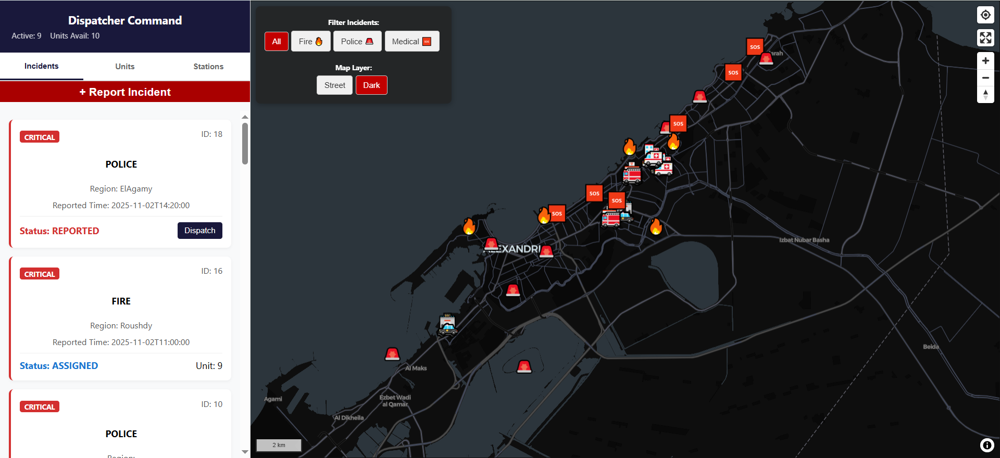
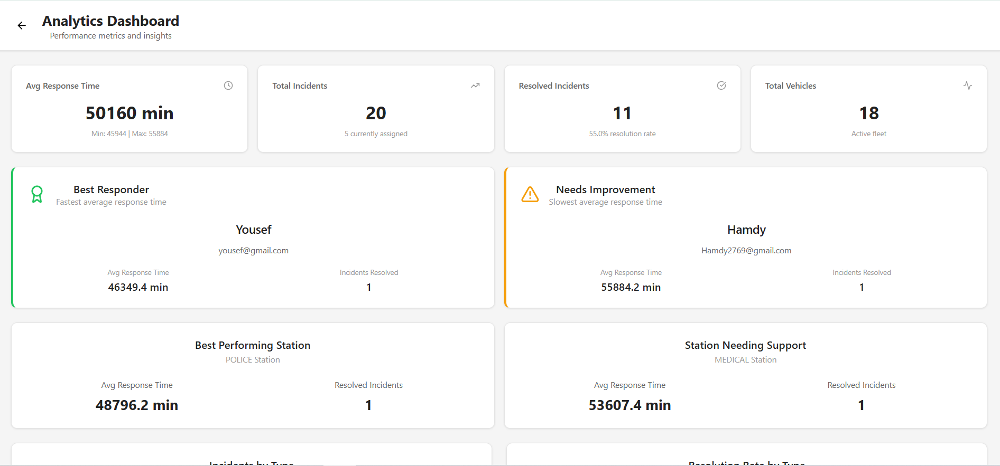
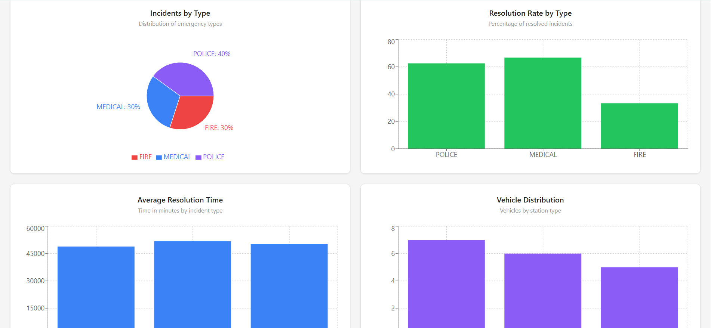
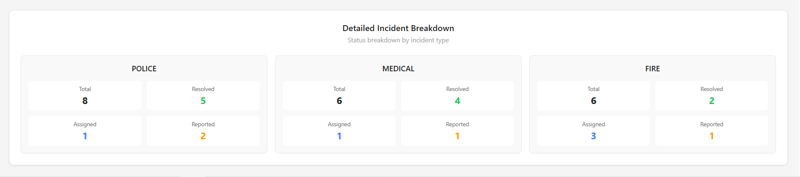
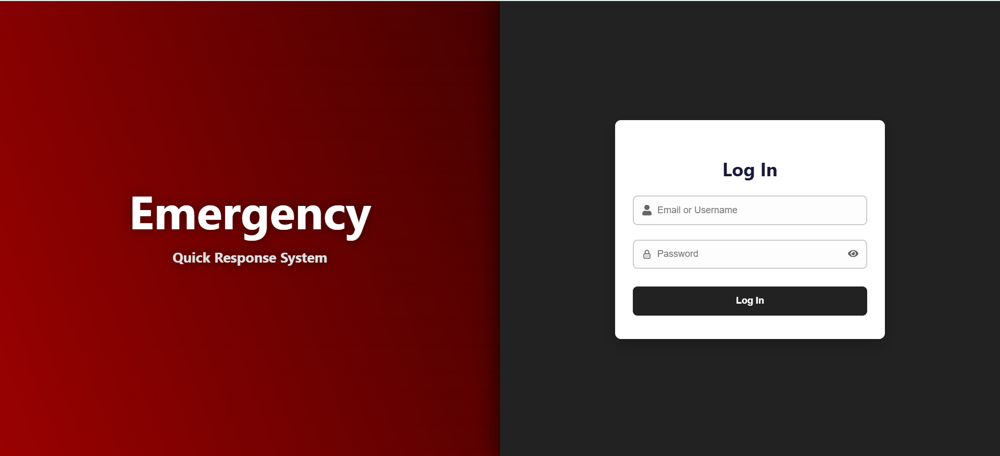
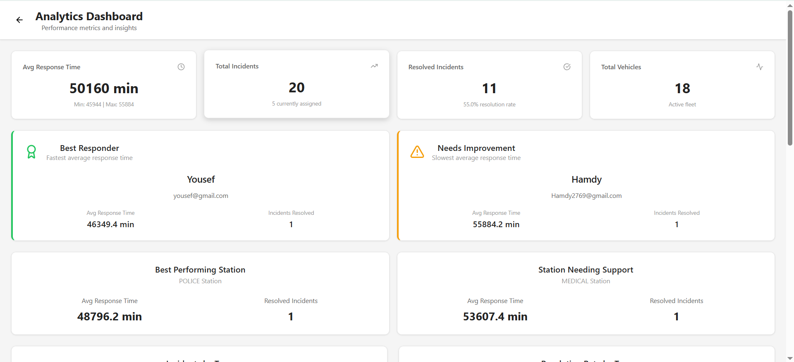
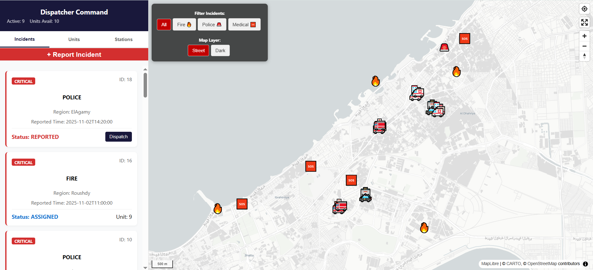
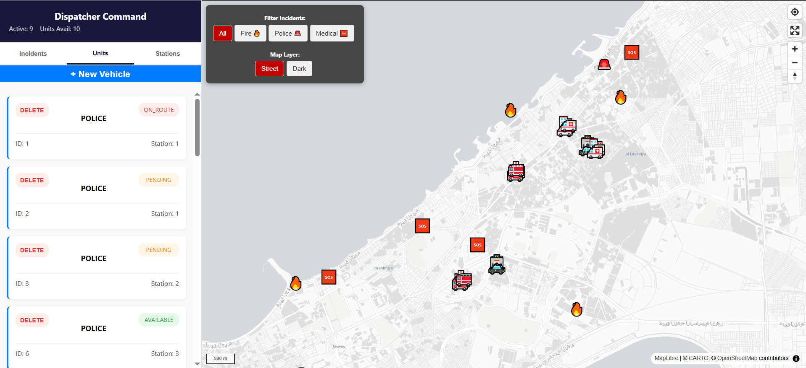
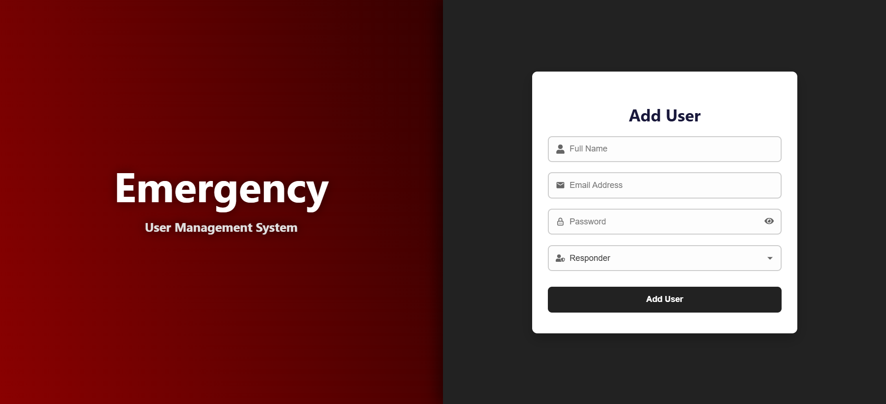

# Emergency Dispatcher System

A comprehensive real-time emergency response management system that enables dispatchers to efficiently manage incidents, track emergency vehicles, and coordinate responses across fire, police, and medical emergencies.


*Main Dashboard Overview*

---

## Table of Contents
- [Overview](#overview)
- [Features](#features)
- [System Architecture](#system-architecture)
- [Technology Stack](#technology-stack)
- [Installation & Setup](#installation--setup)
- [How It Works](#how-it-works)
- [User Roles](#user-roles)
- [Database Schema](#database-schema)
- [API Documentation](#api-documentation)
- [Screenshots](#screenshots)
- [Assumptions & Design Decisions](#assumptions--design-decisions)
- [Future Enhancements](#future-enhancements)

---

## Overview

The Emergency Dispatcher System is a full-stack web application designed to streamline emergency response operations. It provides real-time incident tracking, intelligent vehicle dispatching, and comprehensive analytics to improve response times and operational efficiency.

### Key Capabilities
- **Real-time Incident Management**: Report, track, and resolve emergencies
- **Intelligent Vehicle Dispatch**: Automatic assignment of nearest available units
- **Interactive Mapping**: Visual representation of incidents, vehicles, and stations
- **Role-based Access Control**: Different interfaces for admins, dispatchers, and responders
- **Analytics Dashboard**: Performance metrics and insights
- **Multi-type Emergency Support**: Fire, Police, and Medical incidents


*Secure Login Interface*

---

## Features

### 🚨 Incident Management
- Automatic vehicle assignment based on proximity and availability
- Real-time status updates (Reported → Assigned → Resolved)
- Severity levels (Low, Medium, High, Critical)
- Incident type categorization (Fire, Police, Medical)
- Manual dispatcher override for vehicle reassignment

### 🚑 Vehicle Tracking
- Real-time vehicle location updates
- Status monitoring (Available, Pending, On Route)
- Capacity and responder assignment management
- Station-based vehicle organization

### 🗺️ Interactive Map
- Live incident markers with type-specific icons
- Vehicle location tracking with movement updates
- Station location visualization
- Route planning and optimization
- Multiple map styles (Street, Dark Mode)
- Filter incidents by type

### 📊 Analytics & Reporting
- Average/Min/Max response times
- Best and worst performing responders
- Station performance metrics
- Incident distribution by type
- Resolution rate tracking
- Vehicle distribution analysis

### 👥 User Management
- Three role types: Admin, Dispatcher, Responder
- Secure authentication with JWT tokens
- Password hashing with bcrypt
- Token refresh mechanism


*Interactive Emergency Map*

---

## System Architecture

```
┌─────────────────┐         ┌─────────────────┐         ┌─────────────────┐
│                 │         │                 │         │                 │
│  React Frontend │◄───────►│  Django Backend │◄───────►│  MySQL Database │
│  (Port 3000)    │   REST  │  (Port 8000)    │   SQL   │                 │
│                 │   API   │                 │         │                 │
└─────────────────┘         └─────────────────┘         └─────────────────┘
        │                           │                            │
        │                           │                            │
        ├─ Map (MapLibre GL)        ├─ JWT Authentication       ├─ Spatial Indexes
        ├─ Charts (Recharts)        ├─ bcrypt Hashing          ├─ Triggers
        ├─ React Router             ├─ CORS Middleware         ├─ Stored Procedures
        └─ Axios HTTP Client        └─ Raw SQL Queries         └─ Foreign Keys
```

### Data Flow
1. **Incident Reporting**: User reports incident → Backend validates → Stored procedure finds nearest vehicle → Database triggers notify dispatchers
2. **Vehicle Assignment**: Dispatcher selects vehicle → Backend updates dispatch → Triggers notify responders → Map updates in real-time
3. **Incident Resolution**: Responder marks resolved → Backend updates status and time → Vehicles set to available → Analytics recalculated


*System Architecture*

---

## Technology Stack

### Frontend
- **Framework**: React 19.2.0
- **Routing**: React Router DOM 7.10.0
- **Mapping**: MapLibre GL 5.13.0, React Map GL 8.1.0
- **Charts**: Recharts 3.5.1
- **HTTP Client**: Axios 1.13.2
- **Icons**: Lucide React 0.555.0, React Icons 5.5.0
- **Styling**: Custom CSS

### Backend
- **Framework**: Django 5.2.8
- **Database Driver**: MySQL Client
- **Authentication**: JWT (PyJWT)
- **Password Hashing**: bcrypt
- **CORS**: django-cors-headers
- **Environment**: python-dotenv

### Database
- **DBMS**: MySQL
- **Spatial Data**: PostGIS-style POINT type with SRID 4326
- **Advanced Features**: Stored Procedures, Triggers, Spatial Indexes


*Technology Stack Overview*

---

## Installation & Setup

### Prerequisites
- Node.js (v14+)
- Python (v3.8+)
- MySQL (v8.0+)
- Git

### Backend Setup

1. **Clone the repository**
```bash
git clone <repository-url>
cd emergency-dispatcher
```

2. **Create virtual environment**
```bash
cd backend
python -m venv venv
source venv/bin/activate  # On Windows: venv\Scripts\activate
```

3. **Install dependencies**
```bash
pip install django mysqlclient pyjwt bcrypt django-cors-headers python-dotenv
```

4. **Configure database**
```bash
# Create MySQL database
mysql -u root -p
CREATE DATABASE emergency_dispatcher;
exit;
```

5. **Set up environment variables**
```bash
cp .env.example .env
# Edit .env with your database credentials
```

Example `.env`:
```
DEBUG=True
DB_NAME=emergency_dispatcher
DB_USER=your_mysql_user
DB_PASSWORD=your_mysql_password
DB_HOST=localhost
DB_PORT=3306
SECRET_KEY="your-secret-key-here"
```

6. **Initialize database**
```bash
# Run schema script
mysql -u your_user -p emergency_dispatcher < Database/schema_script.sql

# Run stored procedures
mysql -u your_user -p emergency_dispatcher < Database/stored_procedures.sql

# Run triggers
mysql -u your_user -p emergency_dispatcher < Database/triggers.sql

# Seed sample data
mysql -u your_user -p emergency_dispatcher < Database/sample_seed_data.sql
```

7. **Start backend server**
```bash
cd project
python manage.py runserver
```
Backend will run on `http://localhost:8000`

### Frontend Setup

1. **Navigate to frontend directory**
```bash
cd frontend
```

2. **Install dependencies**
```bash
npm install
```

3. **Start development server**
```bash
npm start
```
Frontend will run on `http://localhost:3000`


---

## How It Works

### 1. Incident Reporting Flow

**Automatic Vehicle Assignment**
```sql
1. Incident reported with location, type, and severity
2. System calls handle_new_incident() stored procedure
3. Procedure searches for nearest available vehicle of matching type:
   - Uses ST_Distance_Sphere() for geospatial calculations
   - Locks vehicle with FOR UPDATE SKIP LOCKED (prevents race conditions)
4. If vehicle found:
   - Updates vehicle status to PENDING
   - Creates dispatch record
   - Triggers notify_dispatchers_after_auto_assign
5. If no vehicle available:
   - Rollback transaction
   - Creates admin notification
   - Returns error
```

**Database Trigger Action**
```sql
CREATE TRIGGER notify_dispatchers_after_auto_assign
AFTER INSERT ON dispatch
- Creates user_notification record
- Links to all users with DISPATCHER role
- Sets status to DELIVERED
```


*Incident Reporting Workflow*

### 2. Dispatcher Assignment Flow

**Manual Override**
```
1. Dispatcher views reported incident
2. Selects "Dispatch" button
3. Chooses available vehicle from dropdown
4. System calls reassign_incident_vehicle() procedure:
   - Validates incident not already resolved
   - Checks new vehicle is available
   - Frees old vehicle (if exists)
   - Assigns new vehicle
   - Updates incident status to ASSIGNED
5. Trigger notify_responders_after_new_assign fires
6. Responders receive notification
```


*Dispatcher Control Panel*

### 3. Response & Resolution Flow

```
1. Responder receives notification
2. Views incident details on map
3. Clicks "Accept Incident"
   - Vehicle status: PENDING → ON_ROUTE
4. Arrives at scene
5. Handles emergency
6. Clicks "Resolve Incident"
   - Calls resolve_incident() procedure
   - Updates incident status to RESOLVED
   - Sets time_resolved timestamp
   - Frees all assigned vehicles
```

### 4. Real-time Map Updates

```javascript
// Frontend polling mechanism
useEffect(() => {
  if (token) {
    fetchData();
    const interval = setInterval(fetchData, 5000); // Poll every 5 seconds
    return () => clearInterval(interval);
  }
}, [token, filter]);

// fetchData retrieves:
- All incidents with current status
- All vehicles with location and status
- All stations with metadata
```


*Real-time Map Visualization*

### 5. Analytics Calculation

**Response Time Metrics**
```sql
-- Average Response Time
SELECT AVG(TIMESTAMPDIFF(MINUTE, time_reported, time_resolved))
FROM incident
WHERE status = 'RESOLVED';

-- Best Responder
SELECT u.user_id, u.name, 
       AVG(TIMESTAMPDIFF(SECOND, i.time_reported, i.time_resolved)) as avg_time
FROM user u
JOIN responder_vehicle rv ON u.user_id = rv.responder_id
JOIN vehicle v ON rv.vehicle_id = v.vehicle_id
JOIN dispatch d ON v.vehicle_id = d.vehicle_id
JOIN incident i ON d.incident_id = i.incident_id
WHERE u.role = 'RESPONDER' AND i.time_resolved IS NOT NULL
GROUP BY u.user_id
ORDER BY avg_time ASC
LIMIT 1;
```




*Performance Analytics*

---

## User Roles

### 🛡️ Admin
**Capabilities:**
- Create/manage users (dispatchers, responders, admins)
- Create/delete vehicles
- Create stations
- View all system analytics
- Access all dispatcher functions

**Credentials (from seed data):**
- Email: `zahraa@gmail.com`
- Password: `password`

### 📡 Dispatcher
**Capabilities:**
- View all incidents
- Manually assign/reassign vehicles to incidents
- View vehicle locations and statuses
- View station information
- Access analytics

**Credentials (from seed data):**
- Email: `zahraa3109@gmail.com`
- Password: `password`

### 🚑 Responder
**Capabilities:**
- View assigned incidents
- Accept incidents (change status to ON_ROUTE)
- Update vehicle location
- Resolve incidents
- View relevant map data

**Credentials (from seed data):**
- Email: `ramy236@gmail.com`
- Password: `password`


---

## Database Schema

### Core Tables

**user**
```sql
- user_id (PK, AUTO_INCREMENT)
- name (VARCHAR)
- email (UNIQUE, VARCHAR)
- password (VARCHAR, bcrypt hashed)
- role (ENUM: DISPATCHER, RESPONDER, ADMIN)
```

**incident**
```sql
- incident_id (PK, AUTO_INCREMENT)
- time_reported (DATETIME, DEFAULT CURRENT_TIMESTAMP)
- time_resolved (DATETIME, NULLABLE)
- location (POINT, SRID 4326)
- type (ENUM: FIRE, POLICE, MEDICAL)
- status (ENUM: REPORTED, ASSIGNED, RESOLVED)
- severity_level (ENUM: LOW, MEDIUM, HIGH, CRITICAL)
```

**vehicle**
```sql
- vehicle_id (PK, AUTO_INCREMENT)
- status (ENUM: AVAILABLE, PENDING, ON_ROUTE)
- location (POINT, SRID 4326)
- capacity (INT)
- station_id (FK → station)
```

**station**
```sql
- station_id (PK, AUTO_INCREMENT)
- type (ENUM: FIRE, POLICE, MEDICAL)
- location (POINT, SRID 4326)
- zone (VARCHAR)
```

**dispatch**
```sql
- dispatch_id (PK, AUTO_INCREMENT)
- vehicle_id (FK → vehicle)
- incident_id (FK → incident)
- dispatcher_id (FK → user, NULLABLE)
- UNIQUE(vehicle_id, incident_id)
```

**responder_vehicle**
```sql
- responder_id (PK, FK → user)
- vehicle_id (FK → vehicle)
```

### Notification Tables

**user_notification**
```sql
- user_notification_id (PK, AUTO_INCREMENT)
- incident_id (FK → incident)
- title (VARCHAR)
- created_at (DATETIME)
```

**user_notification_status**
```sql
- user_notification_id (PK, FK → user_notification)
- user_id (PK, FK → user)
- status (ENUM: SEEN, DELIVERED)
```

**admin_notification**
```sql
- admin_notification_id (PK, AUTO_INCREMENT)
- title (VARCHAR)
- body (TEXT)
- created_at (DATETIME)
```


*Entity Relationship Diagram*

---

## API Documentation

### Authentication Endpoints

**POST /login/**
```json
Request:
{
  "email": "zahraa@gmail.com",
  "password": "password"
}

Response:
{
  "message": "Login successful",
  "user": {
    "user_id": 1,
    "name": "Zahraa",
    "email": "zahraa@gmail.com",
    "role": "ADMIN"
  },
  "access_token": "eyJ0eXAiOiJKV1QiLCJhbGc...",
  "refresh_token": "eyJ0eXAiOiJKV1QiLCJhbGc..."
}
```

**POST /refresh-token/**
```json
Request:
{
  "refresh": "eyJ0eXAiOiJKV1QiLCJhbGc..."
}

Response:
{
  "access_token": "eyJ0eXAiOiJKV1QiLCJhbGc..."
}
```

### Incident Endpoints

**POST /incidents/report/** (Public)
```json
Request:
{
  "type": "FIRE",
  "lat": 31.2251,
  "lng": 29.9467,
  "severity_level": "HIGH"
}

Response:
{
  "message": "Incident reported and vehicle auto-assigned successfully",
  "incident": {
    "incident_id": 21,
    "type": "FIRE",
    "lat": 31.2251,
    "lng": 29.9467,
    "severity_level": "HIGH",
    "status": "REPORTED",
    "vehicle_id": 15,
    ...
  }
}
```

**GET /admin/incidents/** (Auth Required)
```
Query Parameters:
- status: REPORTED | ASSIGNED | RESOLVED (optional)

Response:
{
  "incidents": [
    {
      "incident_id": 1,
      "type": "POLICE",
      "lat": 29.91,
      "lng": 31.22,
      "severity_level": "MEDIUM",
      "status": "RESOLVED",
      "time_reported": "2025-10-26T14:34:57",
      "time_resolved": "2025-10-26T15:12:30",
      "vehicle_ids": "1",
      "station_zones": "Smouha",
      "response_time": 38
    },
    ...
  ],
  "count": 20
}
```

**POST /admin/incidents/dispatch/** (Auth Required)
```json
Request:
{
  "incident_id": 17,
  "new_vehicle_id": 5
}

Response:
{
  "message": "Dispatch modified successfully",
  "incident": { ... }
}
```

**POST /incidents/resolve/** (Auth Required)
```json
Request:
{
  "incident_id": 12
}

Response:
{
  "message": "Incident resolved successfully",
  "incident": {
    "incident_id": 12,
    "status": "RESOLVED",
    "time_resolved": "2025-11-02T15:45:23",
    ...
  }
}
```

### Vehicle Endpoints

**GET /admin/vehicles/** (Auth Required)
```
Query Parameters:
- status: AVAILABLE | PENDING | ON_ROUTE (optional)

Response:
{
  "vehicles": [
    {
      "vehicle_id": 1,
      "status": "ON_ROUTE",
      "lat": 29.9525,
      "lng": 31.2015,
      "capacity": 3,
      "station_id": 1,
      "vehicle_type": "POLICE",
      "zone": "Smouha",
      "responder_count": 2
    },
    ...
  ],
  "count": 20
}
```

**POST /vehicles/location/** (Auth Required)
```json
Request:
{
  "vehicle_id": 1,
  "lat": 29.9530,
  "lng": 31.2020
}

Response:
{
  "message": "Location updated successfully",
  "vehicle": { ... }
}
```

**POST /admin/vehicles/create/** (Admin Only)
```json
Request:
{
  "station_id": 1,
  "capacity": 4,
  "lat": 29.9540,
  "lng": 31.2010
}

Response:
{
  "message": "Vehicle created successfully",
  "vehicle": { ... }
}
```

**DELETE /admin/vehicles/delete/** (Admin Only)
```json
Request:
{
  "vehicle_id": 21
}

Response:
{
  "message": "Vehicle deleted successfully"
}
```

### Station Endpoints

**GET /admin/stations/** (Auth Required)
```json
Response:
{
  "stations": [
    {
      "station_id": 1,
      "type": "POLICE",
      "zone": "Smouha",
      "lat": 29.9540,
      "lng": 31.2010,
      "vehicle_count": 2
    },
    ...
  ],
  "count": 8
}
```

**POST /admin/stations/create/** (Admin Only)
```json
Request:
{
  "type": "MEDICAL",
  "zone": "Raml",
  "lat": 31.2000,
  "lng": 29.9100
}

Response:
{
  "message": "Station created successfully",
  "station": { ... }
}
```

### User Management Endpoints

**GET /admin/users/** (Admin Only)
```json
Response:
{
  "admins": [
    {
      "user_id": 1,
      "email": "zahraa@gmail.com",
      "name": "Zahraa",
      "role": "ADMIN"
    },
    ...
  ],
  "count": 6
}
```

**POST /admin/users/create/** (Admin Only)
```json
Request:
{
  "name": "John Doe",
  "email": "john.doe@example.com",
  "password": "securePassword123",
  "role": "DISPATCHER"
}

Response:
{
  "message": "User created successfully",
  "admin": {
    "user_id": 35,
    "name": "John Doe",
    "email": "john.doe@example.com",
    "role": "DISPATCHER"
  }
}
```

### Analytics Endpoints

**GET /admin/analytics/** (Auth Required)
```json
Response:
{
  "analytics": {
    "average_response_time": 45.3,
    "max_response_time": 120,
    "min_response_time": 15,
    "best_responder": {
      "responder_id": 15,
      "responder_name": "Rawan",
      "email": "rawan@gmail.com",
      "avg_response_time_minutes": 32.5,
      "total_incidents_resolved": 3
    },
    "worst_responder": { ... },
    "best_station": {
      "station_id": 4,
      "station_type": "MEDICAL",
      "average_response_time": 2340.5,
      "resolved_count": 3
    },
    "worst_station": { ... },
    "total_incidents_type": [
      {
        "type": "FIRE",
        "resolved_count": 3,
        "assigned_count": 2,
        "reported_count": 1,
        "total_count": 6,
        "resolution_rate_percentage": 50.0,
        "avg_resolution_time_seconds": 2580.33,
        "avg_resolution_time_minutes": 43.01
      },
      ...
    ],
    "active_vehicles_type": [
      {
        "station_type": "FIRE",
        "vehicle_count": 6
      },
      ...
    ]
  }
}
```


*API Endpoint Overview*

---

## Screenshots

### Login & Authentication

*Secure login with JWT authentication*

### Dispatcher Dashboard

*Main dispatcher control panel with incident overview*


*Filterable incident list with real-time status*


*Vehicle monitoring with status indicators*


### Analytics Dashboard

*Comprehensive analytics dashboard*


*Response time and resolution rate charts*


*Individual responder performance*

### User Management

*Admin user creation interface*

---

## Assumptions & Design Decisions

### 1. Geographic Scope
**Assumption:** The system operates within Alexandria, Egypt (SRID 4326 coordinate system).
- All coordinates use WGS84 geographic coordinate system
- Distance calculations use `ST_Distance_Sphere()` for accurate geodesic measurements
- Sample data centered around Alexandria (latitude ~31.2, longitude ~29.9)

### 2. Vehicle Assignment Logic
**Assumption:** Nearest available vehicle is always the optimal choice.
- Ignores traffic conditions
- Doesn't consider vehicle equipment differences
- No load balancing between stations
- **Rationale:** Simplicity and response time prioritization. Real-world systems would integrate traffic APIs.

### 3. Incident Priority
**Assumption:** Severity levels guide urgency but don't auto-prioritize dispatch.
- Critical incidents don't preempt ongoing responses
- Manual dispatcher judgment is trusted
- **Rationale:** Allows human expertise to override algorithmic decisions in complex scenarios.

### 4. Real-time Updates
**Decision:** 5-second polling instead of WebSockets
- **Rationale:** 
  - Simpler implementation
  - Sufficient for emergency response (not millisecond-critical)
  - Easier to scale horizontally
- **Trade-off:** Slightly higher latency vs WebSocket complexity

### 5. Authentication Strategy
**Decision:** JWT with 15-minute access tokens, 7-day refresh tokens
- **Rationale:**
  - Balance security and user experience
  - Stateless authentication for scalability
  - Auto-logout protects shared workstations
- **Assumption:** Refresh token rotation not implemented (production would require it)

### 6. Database Concurrency
**Decision:** `FOR UPDATE SKIP LOCKED` for vehicle selection
- **Rationale:** Prevents multiple dispatchers from assigning the same vehicle
- **Assumption:** MySQL InnoDB engine with transaction support
- **Alternative Considered:** Optimistic locking rejected due to high collision probability

### 7. Password Storage
**Decision:** bcrypt with salt rounds = 12
- **Rationale:** Industry standard, resistant to rainbow tables
- **Assumption:** Password complexity not enforced (production would require it)

### 8. Spatial Indexing
**Decision:** Spatial index on `station.location`, not on `vehicle.location`
- **Rationale:** 
  - Stations are static, vehicles move frequently
  - Index maintenance cost outweighs benefit for moving objects
  - ST_Distance_Sphere already optimized

### 9. Notification System
**Assumption:** In-app notifications only (no SMS/email)
- **Rationale:** Simplifies MVP, external integrations add complexity
- **Future Enhancement:** Integrate Twilio/SendGrid

### 10. Vehicle Capacity
**Decision:** Capacity field exists but not enforced in assignments
- **Rationale:** 
  - Allows system flexibility
  - Real-world incidents may require exceeding capacity
  - **Future Enhancement:** Capacity-based filtering

### 11. Incident Description
**Decision:** Description field removed from core incident table
- **Rationale:** 
  - Not used in sample data
  - Can be added to `user_notification.body` if needed
- **Assumption:** Type + Severity + Location sufficient for dispatch decisions

### 12. Error Handling
**Assumption:** All API errors return JSON with `{message: "error text"}`
- **Rationale:** Consistent frontend error handling
- **Limitation:** No error codes (production would use HTTP status codes + error codes)

### 13. Time Zones
**Assumption:** All times stored in UTC
- **Rationale:** Django default behavior
- **Limitation:** UI doesn't convert to local time (future enhancement)

### 14. Vehicle Type Matching
**Assumption:** Incident type must exactly match station type
- Example: FIRE incident only dispatched to FIRE vehicles
- **Rationale:** Specialized equipment requirements
- **Limitation:** Cross-type backup not supported

### 15. Map Tiles
**Decision:** CartoDB basemaps (free tier)
- **Rationale:** 
  - No API key required
  - Sufficient detail for emergency services
- **Alternative Considered:** Google Maps rejected due to cost
- **Limitation:** Rate limits on free tier

### 16. Mobile Responsiveness
**Decision:** Desktop-first design
- **Rationale:** Dispatchers typically use desktop workstations
- **Limitation:** Mobile UI not optimized (responders would need native apps)

### 17. Data Persistence
**Assumption:** All resolved incidents kept indefinitely
- **Rationale:** Analytics and audit trail
- **Limitation:** No archival strategy (production would partition old data)

### 18. Seed Data
**Assumption:** All seed users have password "password"
- **Rationale:** Simplifies testing
- **Security Risk:** Production would require forced password change on first login

### 19. CORS Configuration
**Decision:** `CORS_ALLOW_ALL_ORIGINS = True`
- **Rationale:** Development convenience
- **Security Risk:** Production must whitelist specific origins

### 20. Responder-Vehicle Assignment
**Assumption:** One responder per vehicle (primary key on responder_id)
- **Rationale:** 
  - Simplifies data model
  - Real-world crews modeled via capacity field
- **Limitation:** Doesn't track individual crew members


---


## Support

For issues, questions, or contributions:
- Create an issue on GitHub
- Contact: ziadallam1234@gmail.com

---

## Acknowledgments

- MapLibre GL for open-source mapping
- Django community for excellent documentation
- React team for the robust frontend framework
- MySQL for spatial data support


*Thank you for using Emergency Dispatcher System*

---

**Last Updated**: December 2025  
**Version**: 1.0.0